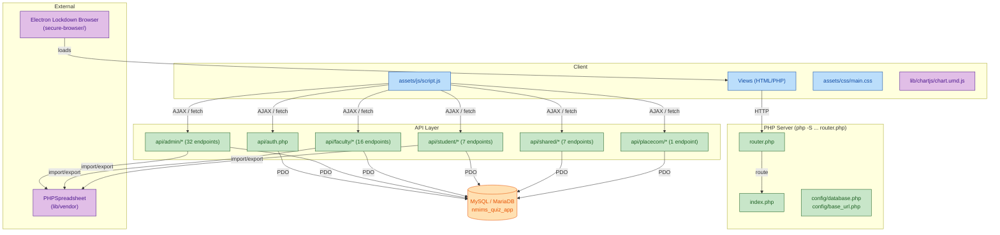

# NMIMS Quiz App 📚

A comprehensive, role-based online examination system built with PHP and MySQL for NMIMS Hyderabad. Supports real-time exam monitoring, automated grading, secure proctoring, multiple question types, and a companion Electron-based lockdown browser.


---

## 📋 Table of Contents
- [Features](#-features)
- [Architecture](#-system-architecture)
- [Technology Stack](#-technology-stack)
- [Project Structure](#-project-structure)
- [Installation](#-installation)
- [Configuration](#-configuration)
- [Usage](#-usage)
- [API Reference](#-api-reference)
- [Testing](#-testing)
- [Secure Browser](#-secure-lockdown-browser)
- [Database Schema](#-database-schema)
- [Security](#-security)
- [License](#-license)

---

## 🌟 Features

### 🎓 Students
- Join quiz lobbies and take live exams with a real-time countdown timer
- Support for **MCQ (single answer)**, **MSQ (multiple answer)**, and **Descriptive** questions
- Auto-save answers as you progress; resume if accidentally disconnected
- Behavior proctoring: tab-switch detection, fullscreen enforcement, copy-paste blocking
- View instant results with per-question breakdowns after submission
- Export personal results as an Excel file

### 👨‍🏫 Faculty
- Create quizzes with fine-grained config: time limits, question counts by difficulty, shuffle, instant results toggle
- Add questions manually or **bulk-upload via Excel template**
- Edit, delete, and re-order questions and options
- Real-time **live monitoring dashboard** with per-student progress and paginated view
- **Quiz lobby** management — see who's ready before starting
- Start, pause, complete, or re-enable exams with one click
- Manually evaluate descriptive answers and override scores
- **Item analysis** — per-question difficulty and discrimination statistics
- Export results to `.xlsx`; publish/unpublish results for students

### 🏢 Admin
- Full **user management**: add, edit, delete students and faculty; bulk-import via Excel
- Manage academic hierarchy: **Schools → Courses → Classes (Batches) → Sections**
- Create and manage **Re-exam groups** and **Electives**
- Demote students between academic years
- Reset user passwords
- System-wide dashboard: live counts of students, faculty, and quizzes
- **Database cleanup** utility — preview and execute orphan-record cleanup

### 🤝 Placement Committee (Placecom)
- Access aggregated quiz results across all exams
- Generate placement-specific reports for recruiting companies
- Track candidate performance across assessments

### 👤 Head (Department Head)
- Dedicated dashboard view for department-level oversight

---

## 🏗️ System Architecture



---

## 🛠️ Technology Stack

| Layer | Technology |
|---|---|
| **Language** | PHP 8.5 |
| **Database** | MySQL / MariaDB (PDO, prepared statements) |
| **Frontend** | HTML5, CSS3 (ITCSS), Vanilla JS (ES6+), Chart.js |
| **Excel I/O** | PHPSpreadsheet (via Composer, in `lib/`) |
| **Lockdown Browser** | Electron 28 (`secure-browser/`) |
| **Session Auth** | PHP native sessions + RBAC |
| **Server** | PHP built-in server via `router.php` |

---

## 📁 Project Structure

```
nmims_quiz_app/
├── api/                              # All backend API endpoints
│   ├── auth.php                      # POST — login / logout
│   ├── admin/                        # Admin-only (role_id = 1)
│   │   ├── add_user.php              # Create student or faculty account
│   │   ├── add_school.php            # POST school_name
│   │   ├── add_course.php            # POST course_name, course_code, duration_years, school_id
│   │   ├── add_batch.php             # POST school_id, course_id, graduation_year → creates a class
│   │   ├── add_class.php             # POST class_id, section_name[], ranges[] → creates batch sections
│   │   ├── add_elective.php          # POST elective_name
│   │   ├── add_re_exam_group.php     # POST group_name, expires_at
│   │   ├── add_re_exam_students.php  # Assign students to re-exam group
│   │   ├── add_elective_students.php # Assign students to elective
│   │   ├── add_role.php              # POST name
│   │   ├── delete_*.php              # DELETE via GET ?id= (school, course, class, batch, elective, re_exam_group, role, user)
│   │   ├── edit_class.php            # Update class SAP ID ranges
│   │   ├── update_user.php           # Edit user details
│   │   ├── upload_students.php       # Bulk import via .xlsx
│   │   ├── demote_students.php       # Year-level demotion (batch)
│   │   ├── demote_single_student.php # Single student demotion
│   │   ├── remove_elective_student.php
│   │   ├── remove_re_exam_student.php
│   │   ├── reset_password.php        # POST JSON {user_id, new_password}
│   │   ├── search_student.php        # GET ?q= full-text search
│   │   ├── get_dashboard_stats.php   # Live counts: students, faculty, quizzes
│   │   ├── get_course_batches.php    # GET ?course_id=
│   │   ├── get_students_for_demotion.php
│   │   ├── cleanup_preview.php       # Preview orphan records
│   │   └── execute_cleanup.php       # Delete orphan records
│   ├── faculty/                      # Faculty-only (role_id = 2)
│   │   ├── create_quiz.php           # POST — full quiz config
│   │   ├── update_quiz.php           # Edit quiz metadata
│   │   ├── delete_quiz.php           # Delete quiz and its questions
│   │   ├── update_quiz_status.php    # POST JSON {quiz_id, new_status_id}
│   │   ├── add_manual_question.php   # POST — question + options + correct answer
│   │   ├── update_question.php       # Edit existing question
│   │   ├── delete_question.php       # POST JSON {question_id}
│   │   ├── upload_questions.php      # Bulk import questions via .xlsx
│   │   ├── get_lobby_students.php    # GET ?id=<quiz_id>
│   │   ├── get_live_monitoring_data.php # GET ?id=<quiz_id>[&page=][&limit=]
│   │   ├── get_quiz_results.php      # GET ?quiz_id=
│   │   ├── get_item_analysis.php     # GET ?quiz_id= — difficulty/discrimination stats
│   │   ├── export_results.php        # GET ?quiz_id= → .xlsx download
│   │   ├── publish_results.php       # POST JSON {quiz_id, action}
│   │   ├── save_evaluation.php       # Grade a descriptive answer
│   │   └── reenable_student.php      # Re-allow a disqualified student
│   ├── student/                      # Student-only (role_id = 4)
│   │   ├── fetch_exam_questions.php  # GET ?id=<quiz_id> — creates attempt, randomises Qs
│   │   ├── save_answer.php           # POST — persist individual answer
│   │   ├── finish_exam.php           # POST — submit, auto-grade, calculate score
│   │   ├── get_attempt_status.php    # GET ?id=<attempt_id>
│   │   ├── get_detailed_results.php  # GET — per-question breakdown
│   │   ├── log_event.php             # POST JSON {attempt_id, event_type, description}
│   │   └── export_student_results.php # GET → personal .xlsx result sheet
│   ├── shared/                       # Any authenticated user
│   │   ├── get_quiz_status.php       # GET ?id= (public)
│   │   ├── get_courses_by_school.php # GET ?school_id=
│   │   ├── get_batches_by_course.php # GET ?course_id=
│   │   ├── get_years_by_course.php   # GET ?course_id=
│   │   ├── get_groups_by_courses.php # GET ?course_ids=1,2,3
│   │   ├── change_password.php       # POST — authenticated password change
│   │   └── export_all_results.php   # GET ?quiz_id= → .xlsx (non-student roles)
│   └── placecom/                     # Placecom role (role_id = 3)
│       └── get_all_quiz_results.php  # Aggregated results across all quizzes
│
├── assets/
│   ├── css/main.css                  # Single consolidated stylesheet (ITCSS)
│   ├── js/script.js                  # Merged: login + exam + dashboard logic
│   ├── images/                       # Logos and icons
│   └── templates/
│       ├── question_template.xlsx    # Excel template for bulk question import
│       └── student_template.xlsx     # Excel template for bulk user import
│
├── config/
│   ├── database.php                  # PDO connection + error handlers
│   └── base_url.php                  # Dynamic base URL helper
│
├── lib/
│   ├── chartjs/chart.umd.js          # Chart.js (not tracked in git — download separately)
│   ├── vendor/                       # Composer packages (PHPSpreadsheet etc.)
│   ├── composer.json
│   └── composer.lock
│
├── secure-browser/                   # Electron lockdown browser
│   ├── main.js                       # Electron main process
│   ├── preload.js                    # Preload script
│   ├── index.html                    # Landing/start screen
│   ├── build/icon.ico
│   └── package.json                  # electron + electron-builder config
│
├── tests/                            # PHP CLI test suite (53 tests)
│   ├── test.php                      # Main runner: php tests/test.php
│   ├── TestClient.php                # cURL-based HTTP client with session/cookie support
│   ├── bootstrap.php                 # Fixture setup + teardown (DB)
│   ├── AuthTest.php                  # 5 auth tests
│   ├── AdminTest.php                 # 15 admin endpoint tests
│   ├── FacultyTest.php               # 11 faculty endpoint tests
│   ├── StudentTest.php               # 10 student workflow tests
│   └── SharedTest.php                # 12 shared + placecom tests
│
├── views/
│   ├── admin/         # Dashboard, user mgmt, schools, courses, batches, electives, re-exams
│   ├── faculty/       # Dashboard, quiz builder, live monitor, item analysis, reports
│   ├── student/       # Dashboard, lobby, exam, results, disqualified
│   ├── placecom/      # Dashboard, reports
│   ├── head/          # Department head dashboard
│   └── shared/        # Shared dashboard, change password
│
├── schema.sql                        # Full database schema + seed data
├── router.php                        # PHP built-in server router (serves static files)
├── index.php                         # Main entry point / request dispatcher
├── login.php                         # Login page
├── logout.php                        # Session destroy + redirect
└── README.md
```

---

## 🚀 Installation

### Prerequisites
- **PHP 8.0+** with extensions: `pdo`, `pdo_mysql`, `curl`, `mbstring`, `gd`, `zip`
- **MySQL 5.7+** or **MariaDB 10.3+**
- **Composer** (for PHPSpreadsheet)
- **Node.js + npm** (only if building the Electron lockdown browser)

### Steps

1. **Clone the repository**
   ```bash
   git clone https://github.com/aarushchaudhary/nmims_quiz_app.git
   cd nmims_quiz_app
   ```

2. **Install PHP dependencies**
   ```bash
   cd lib && composer install && cd ..
   ```

3. **Download Chart.js** (not tracked in git)
   ```bash
   mkdir -p lib/chartjs
   curl -o lib/chartjs/chart.umd.js \
     https://cdn.jsdelivr.net/npm/chart.js@3/dist/chart.umd.js
   ```

4. **Set up the database**
   ```bash
   # Create a dedicated DB user (recommended)
   mysql -u root -p -e "
     CREATE DATABASE nmims_quiz_app CHARACTER SET utf8mb4 COLLATE utf8mb4_unicode_ci;
     CREATE USER 'nmims_quiz_app'@'127.0.0.1' IDENTIFIED BY '123456';
     GRANT ALL PRIVILEGES ON nmims_quiz_app.* TO 'nmims_quiz_app'@'127.0.0.1';
   "

   # Import schema
   mysql -h 127.0.0.1 -u nmims_quiz_app -p123456 nmims_quiz_app < schema.sql
   ```

5. **Start the server**
   ```bash
   php -S localhost:8080 router.php
   ```

6. **Open the app**
   Navigate to **http://localhost:8080** and log in with the default admin credentials seeded by `schema.sql`.

---

## ⚙️ Configuration

### Database (`config/database.php`)
```php
define('DB_HOST', '127.0.0.1');
define('DB_PORT', '3306');
define('DB_NAME', 'nmims_quiz_app');
define('DB_USER', 'nmims_quiz_app');
define('DB_PASS', '123456');
```

### Base URL (`config/base_url.php`)
Automatically detects the server host and port — no manual changes needed for localhost. For production, update the `get_base_url()` function to return your domain.

---

## 📖 Usage

### Student Workflow
1. Log in → view available quizzes on the dashboard
2. Click **Join Lobby** → wait for faculty to open the exam
3. Exam starts → answer MCQ / MSQ / descriptive questions
4. Answers auto-save; a countdown timer tracks remaining time
5. Click **Finish Exam** → automatic grading
6. View instant results and per-question breakdown

### Faculty Workflow
1. **Create Quiz**: set title, time limit, question counts per difficulty, class assignment
2. **Add Questions**: manually via form, or bulk-upload via Excel template
3. **Open Quiz**: change status to *Open* → students can enter the lobby
4. **Start Exam**: status → *In Progress* → exam begins for all lobby members
5. **Live Monitor**: real-time dashboard showing per-student progress
6. **End Exam**: status → *Completed*
7. **Evaluate**: grade descriptive answers, publish results
8. **Export / Analyse**: download `.xlsx` results, view item analysis charts

### Admin Workflow
1. **User Management**: add individual users or bulk-import from `.xlsx`
2. **Academic Structure**: create Schools → Courses → Classes → Batch Sections
3. **Re-exams & Electives**: create groups, assign students
4. **Demote Students**: move students down one academic year
5. **Password Reset**: reset any user's credentials
6. **Cleanup**: preview and delete orphaned database records

---

## 🔌 API Reference

All endpoints are PHP files under `api/`. Session cookies carry authentication.

### Authentication
| Method | Endpoint | Body / Params |
|---|---|---|
| POST | `api/auth.php` | JSON `{email, password, force?}` |

### Admin Endpoints (role_id = 1)
| Method | Endpoint | Key Params |
|---|---|---|
| GET | `api/admin/get_dashboard_stats.php` | — |
| POST | `api/admin/add_user.php` | form fields |
| POST | `api/admin/add_school.php` | `school_name` |
| POST | `api/admin/add_course.php` | `course_name, course_code, duration_years, school_id` |
| POST | `api/admin/add_batch.php` | `school_id, course_id, graduation_year` |
| POST | `api/admin/add_class.php` | `class_id, section_name[], sap_id_range_start[], sap_id_range_end[]` |
| POST | `api/admin/add_elective.php` | `elective_name` |
| POST | `api/admin/add_re_exam_group.php` | `group_name, expires_at` |
| POST | `api/admin/reset_password.php` | JSON `{user_id, new_password}` |
| POST | `api/admin/upload_students.php` | multipart `.xlsx` |
| GET  | `api/admin/delete_school.php` | `?id=` |
| GET  | `api/admin/delete_course.php` | `?id=` |
| GET  | `api/admin/delete_batch.php` | `?id=` |
| GET  | `api/admin/delete_class.php` | `?id=` |
| GET  | `api/admin/delete_elective.php` | `?id=` |
| GET  | `api/admin/delete_re_exam_group.php` | `?id=` |
| GET  | `api/admin/search_student.php` | `?q=` |
| GET  | `api/admin/get_course_batches.php` | `?course_id=` |
| GET  | `api/admin/cleanup_preview.php` | — |
| POST | `api/admin/execute_cleanup.php` | — |

### Faculty Endpoints (role_id = 2)
| Method | Endpoint | Key Params |
|---|---|---|
| POST | `api/faculty/create_quiz.php` | form fields |
| POST | `api/faculty/update_quiz_status.php` | JSON `{quiz_id, new_status_id}` |
| POST | `api/faculty/add_manual_question.php` | `quiz_id, question_text, question_type_id, difficulty_id, points, options[], correct_answer_single` |
| POST | `api/faculty/delete_question.php` | JSON `{question_id}` |
| POST | `api/faculty/publish_results.php` | JSON `{quiz_id, action}` |
| POST | `api/faculty/save_evaluation.php` | descriptive grade fields |
| POST | `api/faculty/upload_questions.php` | multipart `.xlsx` |
| GET  | `api/faculty/get_lobby_students.php` | `?id=<quiz_id>` |
| GET  | `api/faculty/get_live_monitoring_data.php` | `?id=<quiz_id>[&page=][&limit=]` |
| GET  | `api/faculty/get_quiz_results.php` | `?quiz_id=` |
| GET  | `api/faculty/get_item_analysis.php` | `?quiz_id=` |
| GET  | `api/faculty/export_results.php` | `?quiz_id=` → `.xlsx` |

### Student Endpoints (role_id = 4)
| Method | Endpoint | Key Params |
|---|---|---|
| GET  | `api/student/fetch_exam_questions.php` | `?id=<quiz_id>` |
| GET  | `api/student/get_attempt_status.php` | `?id=<attempt_id>` |
| POST | `api/student/save_answer.php` | `attempt_id, question_id, answer` |
| POST | `api/student/finish_exam.php` | `attempt_id` |
| POST | `api/student/log_event.php` | JSON `{attempt_id, event_type, description}` |
| GET  | `api/student/get_detailed_results.php` | `?attempt_id=` |
| GET  | `api/student/export_student_results.php` | `?attempt_id=` → `.xlsx` |

### Shared Endpoints (any authenticated user)
| Method | Endpoint | Key Params |
|---|---|---|
| GET  | `api/shared/get_quiz_status.php` | `?id=<quiz_id>` |
| GET  | `api/shared/get_courses_by_school.php` | `?school_id=` |
| GET  | `api/shared/get_batches_by_course.php` | `?course_id=` |
| GET  | `api/shared/get_years_by_course.php` | `?course_id=` |
| GET  | `api/shared/get_groups_by_courses.php` | `?course_ids=1,2,3` |
| POST | `api/shared/change_password.php` | `old_password, new_password` |
| GET  | `api/shared/export_all_results.php` | `?quiz_id=` → `.xlsx` (non-students) |

### Placecom Endpoint (role_id = 3)
| Method | Endpoint | Key Params |
|---|---|---|
| GET  | `api/placecom/get_all_quiz_results.php` | — |

---

## 🧪 Testing

A zero-dependency PHP CLI test suite lives in `tests/`. It spins up HTTP requests against the running server using cURL and verifies response codes, JSON structure, and DB state.

### Requirements
- PHP 8.0+ with **`curl` extension** (`sudo apt install php8.5-curl`)
- The dev server must be running (`php -S localhost:8080 router.php`)

### Running tests
```bash
# Run all 53 tests
php tests/test.php

# Verbose mode (shows request/response details)
php tests/test.php --verbose

# Filter to a single suite
php tests/test.php --filter=Auth
php tests/test.php --filter=Admin
php tests/test.php --filter=Faculty
php tests/test.php --filter=Student
php tests/test.php --filter=Shared

# Custom server URL
php tests/test.php --base-url=http://localhost:9000
```

### What's tested (53 tests)

| Suite | Tests | Coverage |
|---|---|---|
| **Auth** | 5 | Login success/failure, role validation |
| **Admin** | 15 | Dashboard stats, CRUD for schools/courses/classes/batches/electives/re-exam groups, user mgmt, password reset |
| **Faculty** | 11 | Quiz lifecycle, question CRUD, live monitoring, item analysis, result export |
| **Student** | 10 | Full exam workflow: create attempt → save answer → submit → results |
| **Shared** | 12 | Quiz status lookup, course/batch dropdowns, password change, export auth |

### How it works
- `bootstrap_setup()` inserts a complete set of test fixtures into the real DB before each run
- `bootstrap_cleanup()` at startup removes any stale fixtures from interrupted previous runs
- `bootstrap_teardown()` removes all fixtures after the suite finishes — no test data is ever left behind
- Deletion order respects all FK constraints: `student_answers → student_attempts → questions → quizzes → classes → courses → schools`

---

## 🔒 Secure Lockdown Browser

The `secure-browser/` directory contains an **Electron 28** application that acts as a lockdown browser for exam integrity.

### Features
- Opens the quiz app in a kiosk-mode window (no address bar, no DevTools)
- Prevents switching to other applications during the exam
- Blocks keyboard shortcuts (Alt+Tab, Win key, etc.)
- Packaged for Windows as an NSIS installer or MSI

### Build
```bash
cd secure-browser
npm install
npm run dist        # Produces installer in secure-browser/dist/
```

### Development / launch
```bash
npm start           # Opens the Electron window pointing to localhost:8080
```

---

## 🗄️ Database Schema

Key tables (see `schema.sql` for full DDL):

| Table | Description |
|---|---|
| `users` | All accounts; `role_id` FK → `roles` |
| `roles` | Admin (1), Faculty (2), Placecom (3), Student (4), Head (5) |
| `students` | Student profile: SAP ID, course, graduation year |
| `faculties` | Faculty profile |
| `admins` | Admin profile |
| `schools` | Top-level institution nodes |
| `courses` | Academic programmes (FK → `schools`) |
| `classes` | Cohort per year (FK → `courses`) |
| `batches` | Sections within a class (FK → `classes`) |
| `electives` | Elective subject registry |
| `re_exam_groups` | Re-exam session groups |
| `quizzes` | Quiz config, status, time limits, question counts |
| `exam_statuses` | Draft / Open / In Progress / Completed |
| `questions` | Questions (FK → `quizzes`); type: MCQ / MSQ / Descriptive |
| `options` | Answer options (FK → `questions`) |
| `student_attempts` | One row per student per quiz |
| `student_answers` | Individual answers (FK → `student_attempts`, `questions`) |
| `event_logs` | Proctoring events: tab switches, fullscreen exits, etc. |
| `quiz_lobby` | Students who have joined a quiz lobby |
| `quiz_classes` | Many-to-many: quizzes ↔ classes |
| `heads` | Department head profile |
| `placecom_officers` | Placement committee member profile |

---

## 🔐 Security

| Mechanism | Implementation |
|---|---|
| **Authentication** | PHP sessions; login required for every protected route |
| **RBAC** | Every API endpoint checks `$_SESSION['role_id']` against the required role |
| **SQL Injection** | All queries use PDO prepared statements with bound parameters |
| **Password Storage** | `password_hash()` (bcrypt) + `password_verify()` |
| **Input Validation** | `filter_input()`, `FILTER_VALIDATE_INT`, `trim()` on all user inputs |
| **Proctoring** | Tab-switch, fullscreen exit, copy-paste, right-click events logged per-attempt |
| **Lockdown Browser** | Electron app enforces kiosk mode for high-stakes exams |
| **Error Handling** | `display_errors = off`; all errors logged, never leaked to client |

> **Production note**: For a public deployment, add HTTPS (TLS), update `config/database.php` with strong credentials, and configure a proper web server (nginx / Apache) instead of the PHP built-in server.

---

## 📝 License

Licensed under the **GNU General Public License v3.0** — see [LICENSE](LICENSE) for details.

---

## 👨‍💻 Author

**Aarush Chaudhary** — STME, NMIMS Hyderabad

## 🙏 Acknowledgments

- [PHPSpreadsheet](https://github.com/PHPOffice/PhpSpreadsheet) — Excel import/export
- [Chart.js](https://www.chartjs.org/) — Result visualisation
- [Electron](https://www.electronjs.org/) — Lockdown browser shell
- NMIMS Hyderabad for institutional support