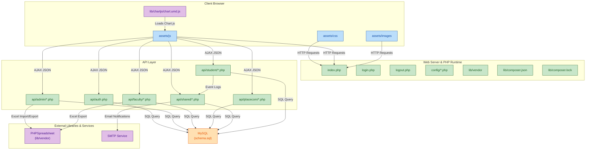

# NMIMS Quiz App 📚

A comprehensive, role-based quiz management system built with PHP and MySQL, designed for educational institutions. Features real-time exam monitoring, automated grading, secure authentication, and support for multiple question types.


## 📋 Table of Contents
- [Features](#-features)
- [Architecture](#-system-architecture)
- [Technology Stack](#-technology-stack)
- [Project Structure](#-project-structure)
- [Installation](#-installation)
- [Usage](#-usage)
- [Database Schema](#-database-schema)
- [API Reference](#-api-reference)
- [Security](#-security)
- [License](#-license)

## 🌟 Features

### For Students
- **Real-time Quiz Participation**: Join quiz lobbies and take exams with live status updates
- **Multiple Question Types**: Support for MCQ (single/multiple choice) and descriptive questions
- **Auto-Save Functionality**: Answers are automatically saved as you progress through the exam
- **Progress Tracking**: Real-time display of current question and total question count
- **Instant Results**: View results immediately after quiz completion with detailed breakdowns
- **Responsive UI**: Optimized exam interface that works on different screen sizes
- **Quiz Timer**: Real-time countdown timer for time-bound exams

### For Faculty
- **Quiz Creation & Management**: Create, edit, and publish quizzes with ease
- **Question Management**: Add, edit, and delete questions individually or in bulk
- **Bulk Upload**: Import questions via Excel spreadsheets using provided templates
- **Real-time Monitoring**: Track student progress during live exams with live dashboard
- **Automated Grading**: Instant automatic grading for objective questions
- **Manual Evaluation**: Interface for grading descriptive answers with feedback
- **Comprehensive Reports**: Export results and generate detailed analytics
- **Item Analysis**: Statistical analysis of question difficulty and student performance
- **Exam Control**: Start, pause, or stop exams in real-time
- **Quiz Status Management**: Enable/disable quizzes and control student access

### For Placement Committee
- **Specialized Assessments**: Create placement-specific tests and aptitude exams
- **Candidate Management**: Track and evaluate placement candidates
- **Company-wise Reports**: Generate reports for different recruiting companies
- **Result Aggregation**: Consolidated view of all placement assessment results

### For Administrators
- **User Management**: Add, edit, and manage student and faculty accounts
- **Bulk User Upload**: Import users via Excel templates for faster onboarding
- **Role Management**: Manage user roles and permissions
- **School & Course Management**: Organize users by schools and courses
- **System Overview**: Monitor all active quizzes and system-wide usage
- **Event Logs**: Track all system events and user activities
- **Password Reset**: Reset student/faculty passwords
- **Dashboard Statistics**: Real-time system statistics and metrics

## 🏗️ System Architecture



### Architecture Overview
- **Frontend Layer**: HTML5, CSS3, and JavaScript (ES6+) with responsive design
- **Server Layer**: PHP runtime handling HTTP requests and serving content
- **API Layer**: RESTful API endpoints organized by role (admin, faculty, student, placecom, shared)
- **Database Layer**: MySQL database with normalized schema for data persistence
- **External Services**: Excel import/export (PHPSpreadsheet) and email notifications (SMTP)

## 🛠️ Technology Stack

### Frontend
- **HTML5** - Semantic markup and form elements
- **CSS3** - Flexbox, Grid, responsive design with ITCSS architecture
- **JavaScript (ES6+)** - Vanilla JS with fetch API for AJAX calls
- **Chart.js** - Data visualization and analytics charts

### Backend
- **PHP 7.4+** - Server-side logic and business operations
- **PDO (PHP Data Objects)** - Database abstraction and prepared statements
- **PHPSpreadsheet** - Excel file import/export functionality
- **Session Management** - Server-side session handling for authentication

### Database
- **MySQL 5.7+** or **MariaDB** - Relational database for data persistence
- **Prepared Statements** - Protection against SQL injection attacks

### Security Features
- Session-based authentication with role-based access control (RBAC)
- Prepared SQL statements to prevent injection attacks
- Input validation and sanitization on all user inputs
- Password hashing for secure credential storage
- CORS and CSRF protection mechanisms

## 📁 Project Structure

```
nmims_quiz_app/
├── api/                              # Backend API endpoints
│   ├── auth.php                      # Authentication & login handler
│   ├── admin/                        # Admin-specific endpoints
│   │   ├── add_user.php
│   │   ├── add_course.php
│   │   ├── add_school.php
│   │   ├── add_role.php
│   │   ├── delete_*.php              # Delete operations
│   │   ├── get_*.php                 # Get/Fetch operations
│   │   ├── reset_password.php
│   │   ├── update_*.php              # Update operations
│   │   └── upload_students.php
│   ├── faculty/                      # Faculty-specific endpoints
│   │   ├── create_quiz.php
│   │   ├── edit_quiz.php
│   │   ├── delete_quiz.php
│   │   ├── upload_questions.php
│   │   ├── get_quiz_results.php
│   │   ├── export_results.php
│   │   ├── get_item_analysis.php
│   │   ├── get_live_monitoring_data.php
│   │   └── update_quiz_status.php
│   ├── placecom/                     # Placement committee endpoints
│   │   └── get_all_quiz_results.php
│   ├── shared/                       # Shared endpoints (all roles)
│   │   ├── get_quiz_status.php
│   │   ├── get_courses_by_school.php
│   │   ├── get_batches_by_course.php
│   │   ├── get_years_by_course.php
│   │   └── export_all_results.php
│   └── student/                      # Student-specific endpoints
│       ├── fetch_exam_questions.php  # Load quiz questions
│       ├── save_answer.php           # Save individual answer
│       ├── finish_exam.php           # Submit exam
│       ├── get_detailed_results.php
│       ├── export_student_results.php
│       ├── log_event.php             # Activity logging
│       └── get_attempt_status.php
├── assets/                           # Static files
│   ├── css/
│   │   └── main.css                  # Consolidated stylesheet (ITCSS architecture)
│   ├── images/                       # Images and icons
│   ├── js/
│   │   └── script.js                 # Merged JS (login + exam logic)
│   └── templates/
│       ├── footer.php                # Footer template
│       ├── header.php                # Header template
│       ├── question_template.xlsx    # Excel template for bulk question upload
│       └── student_template.xlsx     # Excel template for bulk user import
├── config/                           # Configuration files
│   └── database.php                  # Database connection settings
├── lib/                              # External libraries & dependencies
│   ├── chartjs/
│   │   └── chart.umd.js             # Chart.js library
│   ├── vendor/                       # Composer dependencies (PHPSpreadsheet, etc.)
│   ├── composer.json                 # Composer configuration
│   └── composer.lock                 # Locked dependency versions
├── views/                            # User-facing view pages
│   ├── admin/                        # Admin dashboard and management pages
│   │   ├── dashboard.php
│   │   ├── user_management.php
│   │   ├── manage_courses.php
│   │   ├── manage_schools.php
│   │   ├── manage_roles.php
│   │   └── upload_students.php
│   ├── faculty/                      # Faculty pages
│   │   ├── dashboard.php
│   │   ├── create_quiz.php
│   │   ├── manage_quizzes.php
│   │   ├── edit_question.php
│   │   ├── evaluate_descriptive.php
│   │   ├── item_analysis.php
│   │   └── reports.php
│   ├── student/                      # Student pages
│   │   ├── dashboard.php
│   │   ├── lobby.php                 # Quiz lobby/waiting room
│   │   ├── exam.php                  # Exam page (main interface)
│   │   ├── results.php               # Quiz results
│   │   ├── detailed_results.php
│   │   ├── export_student_results.php
│   │   └── disqualified.php
│   ├── placecom/                     # Placement committee pages
│   │   ├── dashboard.php
│   │   └── reports.php
│   └── shared/                       # Shared pages (all roles)
│       └── dashboard.php
├── schema.sql                        # Database schema and tables
├── index.php                         # Main entry point
├── login.php                         # Login page
├── logout.php                        # Logout handler
├── LICENSE                           # MIT License
└── README.md                         # This documentation

```

## 🚀 Quick Start

### Prerequisites
- PHP 7.4 or higher (with PDO and MySQLi extensions)
- MariaDB 10.3+ or MySQL 5.7+
- Composer (for PHP dependencies)
- Git (optional, for cloning)

### Installation

1. **Clone or download the repository**
   ```bash
   git clone <repository-url>
   cd nmims_quiz_app
   ```

2. **Install PHP dependencies**
   ```bash
   cd lib
   composer install
   cd ..
   ```

3. **Fetch Chart.js library**
   Create the chartjs directory if it doesn't exist, then download the Chart.js library:
   ```bash
   mkdir -p lib/chartjs
   curl -o lib/chartjs/chart.umd.js https://cdn.jsdelivr.net/npm/chart.js@3/dist/chart.umd.js
   ```
   This downloads the Chart.js library required for data visualization and analytics charts.
   **Note**: `chart.umd.js` is not tracked in git and must be downloaded during setup (see `.gitignore`).

4. **Configure database**
   - Ensure MariaDB/MySQL service is running
   - Import database schema:
     ```bash
     mysql -h 127.0.0.1 -u root < schema.sql
     ```
   - Default connection: `host=127.0.0.1`, `user=root`, `password=''` (empty), `database=nmims_quiz_app`
   - **Note**: Credentials are hardcoded in `config/database.php` for the built-in server environment

5. **Start the application**
   - Navigate to the project root:
     ```bash
     cd nmims_quiz_appphp -S localhost:8080 router.php
     
     ```
   - Access the app: **http://localhost:8080**
   - Log in with default credentials (set in database schema)

### Configuration
- **Database**: Edit `config/database.php` to update connection settings
- **Base URL**: Automatically configured in `config/base_url.php` for localhost:8080
- **Static Files**: Router (`router.php`) automatically serves CSS, JS, and images

## 📖 Usage

### For Students
1. Log in with your credentials
2. Navigate to available quizzes from the dashboard
3. Click "Join Quiz" to enter the lobby
4. Click anywhere on the lobby page to begin the exam
5. Answer questions and click "Next Question"
6. Review your answers before final submission
7. Click "Finish Exam" to submit
8. View results on the results page

### For Faculty
1. Log in to access the faculty dashboard
2. Create a new quiz: Click "Create Quiz" and fill in details
3. Add questions: Use "Add Question" or bulk upload via Excel
4. Publish the quiz: Set quiz status to "Active"
5. Monitor live exams: Use "Live Monitoring" to track student progress
6. Evaluate answers: Manual evaluation for descriptive questions
7. Generate reports: Export results and view analytics

### For Administrators
1. Log in to the admin dashboard
2. Manage users: Add, edit, or delete student/faculty accounts
3. Manage academic structure: Schools, courses, batches
4. Upload users: Use Excel template for bulk import
5. View system logs: Monitor all system activities
6. Reset passwords: Reset user credentials if needed

## 🗄️ Database Schema

Key tables:
- **users** - User accounts with roles
- **quizzes** - Quiz definitions and metadata
- **questions** - Quiz questions with type and options
- **options** - Answer options for MCQ questions
- **attempts** - Student quiz attempts and submissions
- **answers** - Individual student answers per question
- **event_logs** - System activity and audit logs
- **schools** - Educational institutions
- **courses** - Academic courses

See `schema.sql` for complete database structure.

## 🔌 API Reference

### Authentication
- **POST** `/api/auth.php` - Login with username and password

### Student APIs
- **GET** `/api/student/fetch_exam_questions.php?id=<quiz_id>` - Get quiz questions
- **POST** `/api/student/save_answer.php` - Save individual answer
- **POST** `/api/student/finish_exam.php` - Submit exam
- **GET** `/api/student/get_detailed_results.php` - Get detailed results

### Faculty APIs
- **POST** `/api/faculty/create_quiz.php` - Create new quiz
- **POST** `/api/faculty/upload_questions.php` - Bulk upload questions
- **POST** `/api/faculty/update_quiz_status.php` - Update quiz status
- **GET** `/api/faculty/get_quiz_results.php` - Get quiz results
- **GET** `/api/faculty/get_live_monitoring_data.php` - Get live monitoring data

### Admin APIs
- **POST** `/api/admin/add_user.php` - Create user
- **POST** `/api/admin/upload_students.php` - Bulk upload users

### Shared APIs
- **GET** `/api/shared/get_quiz_status.php?id=<quiz_id>` - Get quiz status
- **GET** `/api/shared/get_courses_by_school.php` - Get courses by school
- **GET** `/api/shared/get_quiz_reports.php` - Fetch aggregated report data for a quiz

## 🔐 Security

The application implements multiple security measures:

1. **Authentication**: Session-based login system with role validation
2. **Authorization**: Role-based access control (RBAC) for different user types
3. **SQL Injection Prevention**: All database queries use prepared statements with parameterized queries
4. **Input Validation**: Server-side validation of all user inputs
5. **Password Security**: Passwords hashed using PHP's `password_hash()` function
6. **Session Management**: Secure session configuration with timeout
7. **CSRF Protection**: Token-based protection against cross-site requests
8. **Data Encryption**: Sensitive data encrypted in transit (HTTPS recommended)

## 📝 License

This project is licensed under the **GNU General Public License v3.0** - see the [LICENSE](LICENSE) file for details. You are free to use, modify, and distribute this software under the terms of the GPL 3.0 license.

## 👨‍💻 Author

**Aarush Chaudhary** - STME, NMIMS Hyderabad

## 🙏 Acknowledgments

- NMIMS Hyderabad for institutional support
- Open-source community for excellent libraries (PHPSpreadsheet, Chart.js)
- All contributors and testers

## 📧 Support & Issues

For bug reports, feature requests, or questions, please reach out to the development team.
   cd nm-quiz-app
   ```

2. **Install PHP dependencies**
   ```bash
   composer install
   ```

3. **Create database**
   ```sql
   CREATE DATABASE nmims_quiz_db;
   ```

4. **Import database schema**
   ```bash
   mysql -u your_username -p nmims_quiz_db < schema.sql
   ```

5. **Configure database connection**
   - Copy `config/database.php.example` to `config/database.php`
   - Update database credentials:
   ```php
   define('DB_HOST', 'localhost');
   define('DB_NAME', 'nmims_quiz_db');
   define('DB_USER', 'your_username');
   define('DB_PASS', 'your_password');
   ```

6. **Set proper permissions**
   ```bash
   chmod 755 -R nmims_quiz_app/
   chmod 777 uploads/  # If you have an uploads directory
   ```

7. **Configure web server**
   - Point your web server's document root to the `nmims_quiz_app` directory
   - Ensure mod_rewrite is enabled for Apache

## ⚙️ Configuration

### Application Settings
Edit `config/constants.php` to configure:
- Session timeout duration
- Maximum file upload size
- Quiz timer settings
- Proctoring strictness levels

### Email Configuration
Configure email settings for notifications:
```php
define('SMTP_HOST', 'smtp.example.com');
define('SMTP_PORT', 587);
define('SMTP_USER', 'your_email@example.com');
define('SMTP_PASS', 'your_password');
```

## 📖 Usage

### Initial Setup
1. Access the application at `http://your-domain.com`
2. Log in with the default admin credentials:
   - Username: `admin`
   - Password: `admin123` (Change immediately!)
3. Create faculty and student accounts
4. Faculty can start creating quizzes

### Creating a Quiz (Faculty)
1. Log in with faculty credentials
2. Navigate to "Create Quiz"
3. Fill in quiz details:
   - Title and description
   - Time limit and attempt restrictions
   - Question shuffle settings
4. Add questions manually or upload via Excel
5. Save and publish the quiz

### Taking a Quiz (Student)
1. Log in with student credentials
2. View available quizzes on dashboard
3. Click "Join Lobby" for the desired quiz
4. Wait for faculty to start the exam
5. Complete all questions within the time limit
6. Submit the quiz

## 👥 User Roles

### Administrator
- Full system access
- User management (CRUD operations)
- System configuration
- View all quizzes and results

### Faculty
- Create and manage quizzes
- Monitor live exams
- Grade descriptive answers
- Generate reports
- Export results

### Placement Committee
- Create placement-specific assessments
- Manage recruitment drives
- Generate company-wise reports
- Track candidate performance

### Student
- Take assigned quizzes
- View results and feedback
- Track quiz history

## 🔒 Security Features

- **Authentication**: Session-based authentication with secure password hashing
- **SQL Injection Prevention**: Prepared statements for all database queries
- **XSS Protection**: Input sanitization and output escaping
- **CSRF Protection**: Token-based form submissions
- **Exam Proctoring**:
  - Fullscreen enforcement
  - Tab switching detection
  - Copy-paste prevention
  - Right-click disabled during exams

## 📡 API Documentation

### Authentication
```
POST /api/auth.php
Parameters: username, password, role
Response: {success: boolean, message: string, user_data: object}
```

### Faculty Endpoints
```
POST /api/faculty/create_quiz.php
GET  /api/faculty/get_quizzes.php
POST /api/faculty/start_exam.php
GET  /api/faculty/monitor_progress.php
```

### Student Endpoints
```
POST /api/student/join_lobby.php
GET  /api/student/fetch_questions.php
POST /api/student/submit_answer.php
POST /api/student/finish_exam.php
```

## 🤝 Contributing

We welcome contributions! Please follow these steps:

1. Fork the repository
2. Create a feature branch (`git checkout -b feature/AmazingFeature`)
3. Commit your changes (`git commit -m 'Add some AmazingFeature'`)
4. Push to the branch (`git push origin feature/AmazingFeature`)
5. Open a Pull Request

### Coding Standards
- Follow PSR-12 for PHP code
- Use meaningful variable and function names
- Comment complex logic
- Write unit tests for new features

## 📝 License

This project is licensed under the MIT License - see the [LICENSE](LICENSE) file for details.

## 🙏 Acknowledgments

- NMIMS for the project requirements
- PHPSpreadsheet contributors
- Chart.js team
- All contributors to this project

## 📞 Support

For issues and feature requests, please [create an issue](https://github.com/aarushchaudhary/nm-quiz-app/issues) on GitHub.

---

**Note**: This is an educational project. For production use, ensure proper security auditing and testing.